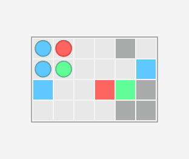
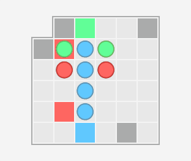
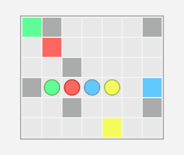

# Puzzle #

A challenging and no-frills logic puzzle. It is currently available for [desktop](android/assets/github/PuzzleDesktop.zip) as an executable jar and for [Android](https://play.google.com/store/apps/details?id=com.kevinalbs.puzzle) through the play store.

Each level is designed to have challenging and non-obvious solutions.

The rules are straightforward and never change.

The initial release comes with ten levels and levels will be incrementally added.

### Development ###
Puzzle is created with the [LibGDX game framework](https://libgdx.badlogicgames.com). Puzzle does not have everything I initially wanted it to have. I will continue adding additional features if there is interest. Some of these include:

- Landscape rendering and resizability in Desktop
- A web release (this requires pre-generated font sizes since the [LibGDX freetype font generator](https://github.com/libgdx/libgdx/wiki/Gdx-freetype) is not available for the web builds)
- Sound effects for pieces moving and stopping
- Rendering the board to a pixmap to avoid additional render logic